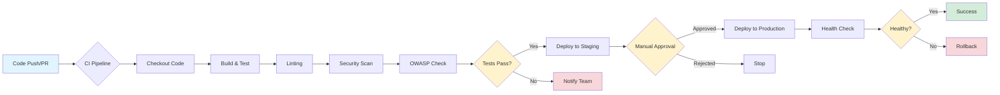
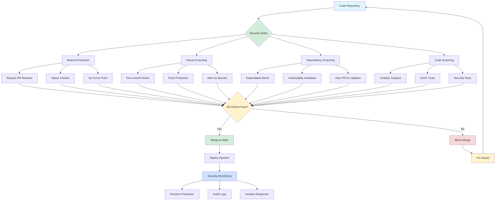

# DevOps CI/CD & Security Guide

## Overview
This guide provides step-by-step instructions for setting up CI/CD pipelines, managing environments and secrets, and implementing security best practices in GitHub.

---

## CI/CD Pipeline Setup
### Steps:
1. **Define CI/CD policy and oversee Secrets/Environments setup**
2. **Track progress of Build & Test pipeline configuration**
3. **Develop build & test workflows in GitHub Actions**

### Example Workflow (Node.js - Build & Test):
```yaml
name: CI Pipeline
on:
  push:
    branches: [ main ]
  pull_request:
    branches: [ main ]

jobs:
  build-and-test:
    runs-on: ubuntu-latest
    steps:
      - name: Checkout code
        uses: actions/checkout@v3

      - name: Set up Node.js
        uses: actions/setup-node@v3
        with:
          node-version: '18'
          cache: 'npm'

      - name: Install dependencies
        run: npm ci

      - name: Run linter
        run: npm run lint

      - name: Run tests
        run: npm test

      - name: Run security audit
        run: npm audit --audit-level=moderate

  security-scan:
    runs-on: ubuntu-latest
    permissions:
      security-events: write
      contents: read
    steps:
      - name: Checkout code
        uses: actions/checkout@v3

      - name: Initialize CodeQL
        uses: github/codeql-action/init@v2
        with:
          languages: javascript

      - name: Perform CodeQL Analysis
        uses: github/codeql-action/analyze@v2

      - name: Run OWASP Dependency Check
        uses: dependency-check/Dependency-Check_Action@main
        with:
          project: 'my-project'
          path: '.'
          format: 'HTML'

      - name: Upload dependency check results
        uses: actions/upload-artifact@v3
        with:
          name: dependency-check-report
          path: reports/
```

### Environment & Promotion:
```yaml
jobs:
  deploy-staging:
    runs-on: ubuntu-latest
    environment: staging
    steps:
      - name: Deploy to Staging
        run: echo "Deploying to Staging"

  deploy-prod:
    runs-on: ubuntu-latest
    environment: production
    needs: deploy-staging
    steps:
      - name: Deploy to Production
        run: echo "Deploying to Production"
```

### CI/CD Pipeline Diagram:


**Pipeline Stages Explained:**
1. **Source**: Developer pushes code or creates pull request
2. **Build**: Install dependencies and compile code
3. **Test**: Run unit tests, integration tests, and linting
4. **Security**: CodeQL analysis, dependency scanning, vulnerability checks
5. **Deploy to Staging**: Automatic deployment to staging environment
6. **Manual Approval**: Required review before production
7. **Deploy to Production**: Deploy to production environment
8. **Monitor**: Health checks and smoke tests

### Example Workflow (Python - Build & Test):
```yaml
name: Python CI

on: [push, pull_request]

jobs:
  test:
    runs-on: ubuntu-latest
    strategy:
      matrix:
        python-version: ['3.9', '3.10', '3.11']
    steps:
      - uses: actions/checkout@v3

      - name: Set up Python ${{ matrix.python-version }}
        uses: actions/setup-python@v4
        with:
          python-version: ${{ matrix.python-version }}
          cache: 'pip'

      - name: Install dependencies
        run: |
          pip install -r requirements.txt
          pip install pytest pytest-cov flake8 bandit

      - name: Lint with flake8
        run: flake8 . --count --select=E9,F63,F7,F82 --show-source --statistics

      - name: Security check with Bandit
        run: bandit -r . -f json -o bandit-report.json

      - name: Run tests with coverage
        run: pytest --cov=./ --cov-report=xml

      - name: Upload coverage to Codecov
        uses: codecov/codecov-action@v3
```

### Example Workflow (Java/Maven - Build & Test):
```yaml
name: Java CI

on: [push, pull_request]

jobs:
  build:
    runs-on: ubuntu-latest
    steps:
      - uses: actions/checkout@v3

      - name: Set up JDK 17
        uses: actions/setup-java@v3
        with:
          java-version: '17'
          distribution: 'temurin'
          cache: 'maven'

      - name: Build with Maven
        run: mvn clean install -DskipTests

      - name: Run tests
        run: mvn test

      - name: Run OWASP Dependency Check
        run: mvn org.owasp:dependency-check-maven:check

      - name: SonarQube Scan
        env:
          SONAR_TOKEN: ${{ secrets.SONAR_TOKEN }}
        run: mvn sonar:sonar -Dsonar.host.url=${{ secrets.SONAR_URL }}
```

### Example Workflow (Go - Build & Test):
```yaml
name: Go CI

on: [push, pull_request]

jobs:
  test:
    runs-on: ubuntu-latest
    steps:
      - uses: actions/checkout@v3

      - name: Set up Go
        uses: actions/setup-go@v4
        with:
          go-version: '1.21'
          cache: true

      - name: Install dependencies
        run: go mod download

      - name: Run go vet
        run: go vet ./...

      - name: Run golangci-lint
        uses: golangci/golangci-lint-action@v3

      - name: Run tests
        run: go test -v -race -coverprofile=coverage.txt -covermode=atomic ./...

      - name: Run gosec security scanner
        run: |
          go install github.com/securego/gosec/v2/cmd/gosec@latest
          gosec -fmt json -out gosec-report.json ./...
```

### Example Workflow (Docker - Build & Scan):
```yaml
name: Docker Build and Scan

on: [push, pull_request]

jobs:
  docker:
    runs-on: ubuntu-latest
    steps:
      - uses: actions/checkout@v3

      - name: Set up Docker Buildx
        uses: docker/setup-buildx-action@v2

      - name: Build Docker image
        uses: docker/build-push-action@v4
        with:
          context: .
          push: false
          tags: myapp:${{ github.sha }}
          cache-from: type=gha
          cache-to: type=gha,mode=max

      - name: Run Trivy vulnerability scanner
        uses: aquasecurity/trivy-action@master
        with:
          image-ref: myapp:${{ github.sha }}
          format: 'sarif'
          output: 'trivy-results.sarif'

      - name: Upload Trivy results
        uses: github/codeql-action/upload-sarif@v2
        with:
          sarif_file: 'trivy-results.sarif'
```

---

## Environment & Secrets Management

### Setting up Secrets:
1. Navigate to GitHub Settings → Secrets and variables → Actions
2. Add repository secrets or environment-specific secrets
3. Use descriptive naming conventions (e.g., `PROD_DB_PASSWORD`, `STAGING_API_KEY`)

### Best Practices:
- Use environment-specific secrets for different deployment stages
- Rotate secrets regularly
- Never commit secrets to version control
- Use secret scanning to detect accidentally committed secrets
- Limit secret access to specific environments

### Cloud Provider Examples:

#### AWS:
```yaml
- name: Configure AWS credentials
  uses: aws-actions/configure-aws-credentials@v2
  with:
    aws-access-key-id: ${{ secrets.AWS_ACCESS_KEY_ID }}
    aws-secret-access-key: ${{ secrets.AWS_SECRET_ACCESS_KEY }}
    aws-region: us-east-1

- name: Deploy to S3
  run: aws s3 sync ./build s3://${{ secrets.S3_BUCKET_NAME }}
```

#### Azure:
```yaml
- name: Login to Azure
  uses: azure/login@v1
  with:
    creds: ${{ secrets.AZURE_CREDENTIALS }}

- name: Deploy to Azure Web App
  uses: azure/webapps-deploy@v2
  with:
    app-name: ${{ secrets.AZURE_WEBAPP_NAME }}
```

#### Google Cloud Platform:
```yaml
- name: Authenticate to Google Cloud
  uses: google-github-actions/auth@v1
  with:
    credentials_json: ${{ secrets.GCP_SA_KEY }}

- name: Deploy to Cloud Run
  run: |
    gcloud run deploy ${{ secrets.SERVICE_NAME }} \
      --image gcr.io/${{ secrets.GCP_PROJECT_ID }}/app:latest \
      --region us-central1
```

#### Generic API Keys & Database Credentials:
```yaml
- name: Run application with secrets
  env:
    DATABASE_URL: ${{ secrets.DATABASE_URL }}
    API_KEY: ${{ secrets.API_KEY }}
    STRIPE_SECRET_KEY: ${{ secrets.STRIPE_SECRET_KEY }}
  run: npm start
```

---

## Security & Branch Protection
### Branch Protection Rules:
- Require Pull Request Reviews
- Require Status Checks
- Block force pushes

### Dependabot Configuration:
```yaml
version: 2
updates:
  - package-ecosystem: "npm"
    directory: "/"
    schedule:
      interval: "weekly"
```

### Secret Scanning & Alerts:
- Enable in GitHub Settings → Code Security & Analysis

### Security Flow Diagram:


**Security Layers:**
1. **Prevention**: Branch protection, pre-commit hooks, push protection
2. **Detection**: Secret scanning, CodeQL, Dependabot, SAST tools
3. **Response**: Alerts, notifications, automated fixes
4. **Monitoring**: Runtime security, audit logs, incident response

---

## Security Testing

### Comprehensive Security Test Examples:

#### 1. SQL Injection Protection (JavaScript):
```javascript
describe('SQL Injection Protection', () => {
  test('SQL Injection attempt should fail', async () => {
    const response = await request(app)
      .post('/login')
      .send({ username: "' OR 1=1 --", password: "fake" });
    expect(response.status).toBe(400);
    expect(response.body.error).toContain('Invalid input');
  });

  test('Union-based SQL injection should fail', async () => {
    const response = await request(app)
      .get('/users?id=1 UNION SELECT password FROM users');
    expect(response.status).toBe(400);
  });
});
```

#### 2. Cross-Site Scripting (XSS) Protection:
```javascript
describe('XSS Protection', () => {
  test('Script injection in input should be sanitized', async () => {
    const response = await request(app)
      .post('/comments')
      .send({ comment: '<script>alert("XSS")</script>' });
    expect(response.status).toBe(200);
    expect(response.body.comment).not.toContain('<script>');
  });

  test('Event handler injection should be sanitized', async () => {
    const maliciousInput = '';
    const response = await request(app)
      .post('/profile')
      .send({ bio: maliciousInput });
    expect(response.body.bio).not.toMatch(/onerror=/i);
  });
});
```

#### 3. Authentication & Authorization Tests:
```javascript
describe('Authentication & Authorization', () => {
  test('Unauthorized access should be blocked', async () => {
    const response = await request(app)
      .get('/admin/dashboard');
    expect(response.status).toBe(401);
  });

  test('Expired token should be rejected', async () => {
    const expiredToken = 'expired.jwt.token';
    const response = await request(app)
      .get('/api/protected')
      .set('Authorization', `Bearer ${expiredToken}`);
    expect(response.status).toBe(401);
  });

  test('User should not access other user resources', async () => {
    const response = await request(app)
      .get('/api/users/999/private-data')
      .set('Authorization', `Bearer ${userToken}`);
    expect(response.status).toBe(403);
  });
});
```

#### 4. CSRF Protection:
```javascript
describe('CSRF Protection', () => {
  test('Request without CSRF token should fail', async () => {
    const response = await request(app)
      .post('/api/transfer')
      .send({ amount: 1000, to: 'attacker' });
    expect(response.status).toBe(403);
  });

  test('Request with invalid CSRF token should fail', async () => {
    const response = await request(app)
      .post('/api/transfer')
      .set('X-CSRF-Token', 'invalid-token')
      .send({ amount: 1000, to: 'attacker' });
    expect(response.status).toBe(403);
  });
});
```

#### 5. Input Validation & Sanitization:
```javascript
describe('Input Validation', () => {
  test('Excessive payload size should be rejected', async () => {
    const largePayload = 'a'.repeat(10000000); // 10MB
    const response = await request(app)
      .post('/api/data')
      .send({ data: largePayload });
    expect(response.status).toBe(413);
  });

  test('Invalid email format should be rejected', async () => {
    const response = await request(app)
      .post('/register')
      .send({ email: 'not-an-email', password: 'pass123' });
    expect(response.status).toBe(400);
  });
});
```

#### 6. Security Headers Test:
```javascript
describe('Security Headers', () => {
  test('Should have proper security headers', async () => {
    const response = await request(app).get('/');
    expect(response.headers['x-frame-options']).toBe('DENY');
    expect(response.headers['x-content-type-options']).toBe('nosniff');
    expect(response.headers['strict-transport-security']).toBeDefined();
    expect(response.headers['content-security-policy']).toBeDefined();
  });
});
```

#### 7. Rate Limiting Test:
```javascript
describe('Rate Limiting', () => {
  test('Excessive requests should be rate limited', async () => {
    const requests = [];
    for (let i = 0; i < 100; i++) {
      requests.push(request(app).get('/api/endpoint'));
    }
    const responses = await Promise.all(requests);
    const rateLimited = responses.filter(r => r.status === 429);
    expect(rateLimited.length).toBeGreaterThan(0);
  });
});
```

---

## Monitoring & Alerting

### CI/CD Pipeline Monitoring:
```yaml
name: Monitor Pipeline Health

on:
  workflow_run:
    workflows: ["CI Pipeline"]
    types: [completed]

jobs:
  notify:
    runs-on: ubuntu-latest
    steps:
      - name: Check workflow status
        run: |
          if [ "${{ github.event.workflow_run.conclusion }}" == "failure" ]; then
            echo "Pipeline failed!"
            exit 1
          fi

      - name: Send Slack notification
        if: failure()
        uses: slackapi/slack-github-action@v1
        with:
          webhook-url: ${{ secrets.SLACK_WEBHOOK_URL }}
          payload: |
            {
              "text": "⚠️ CI Pipeline Failed",
              "blocks": [
                {
                  "type": "section",
                  "text": {
                    "type": "mrkdwn",
                    "text": "*Pipeline:* ${{ github.workflow }}\n*Branch:* ${{ github.ref }}\n*Status:* Failed ❌"
                  }
                }
              ]
            }
```

### Security Alert Integration:
```yaml
name: Security Alerts

on:
  schedule:
    - cron: '0 0 * * *'  # Daily at midnight

jobs:
  security-check:
    runs-on: ubuntu-latest
    steps:
      - name: Checkout code
        uses: actions/checkout@v3

      - name: Run Trivy vulnerability scanner
        uses: aquasecurity/trivy-action@master
        with:
          scan-type: 'fs'
          scan-ref: '.'
          format: 'sarif'
          output: 'trivy-results.sarif'

      - name: Upload Trivy results to GitHub Security
        uses: github/codeql-action/upload-sarif@v2
        with:
          sarif_file: 'trivy-results.sarif'

      - name: Send email alert on critical vulnerabilities
        if: failure()
        uses: dawidd6/action-send-mail@v3
        with:
          server_address: smtp.gmail.com
          server_port: 465
          username: ${{ secrets.EMAIL_USERNAME }}
          password: ${{ secrets.EMAIL_PASSWORD }}
          subject: 'Critical Security Vulnerabilities Detected'
          body: 'Critical vulnerabilities found in ${{ github.repository }}'
          to: security-team@example.com
```

### Performance & Uptime Monitoring:
```yaml
- name: Deploy and monitor
  run: |
    # Deploy application
    ./deploy.sh

    # Wait for deployment
    sleep 30

    # Health check
    curl -f https://myapp.com/health || exit 1

- name: Run smoke tests
  run: |
    npm run test:smoke

- name: Monitor response time
  run: |
    RESPONSE_TIME=$(curl -o /dev/null -s -w '%{time_total}' https://myapp.com)
    if (( $(echo "$RESPONSE_TIME > 2.0" | bc -l) )); then
      echo "Response time too high: ${RESPONSE_TIME}s"
      exit 1
    fi
```

### Metrics Collection:
- **Build Duration**: Track pipeline execution time
- **Test Coverage**: Monitor code coverage trends
- **Deployment Frequency**: Measure deployment cadence
- **Failure Rate**: Track failed deployments
- **Mean Time to Recovery (MTTR)**: Time to fix failed deployments

### Alert Channels:
- Slack/Microsoft Teams for team notifications
- Email for critical security issues
- GitHub Issues for automated bug reporting
- PagerDuty/OpsGenie for incident management

---

## Hands-On Checklist
- Configure CI/CD workflows with security scanning
- Set up environments and secrets for multiple cloud providers
- Apply branch protection rules
- Enable Dependabot and secret scanning
- Implement comprehensive security tests (SQL injection, XSS, CSRF, etc.)
- Set up monitoring and alerting for pipeline failures
- Configure security vulnerability scanning
- Establish metrics collection and reporting
